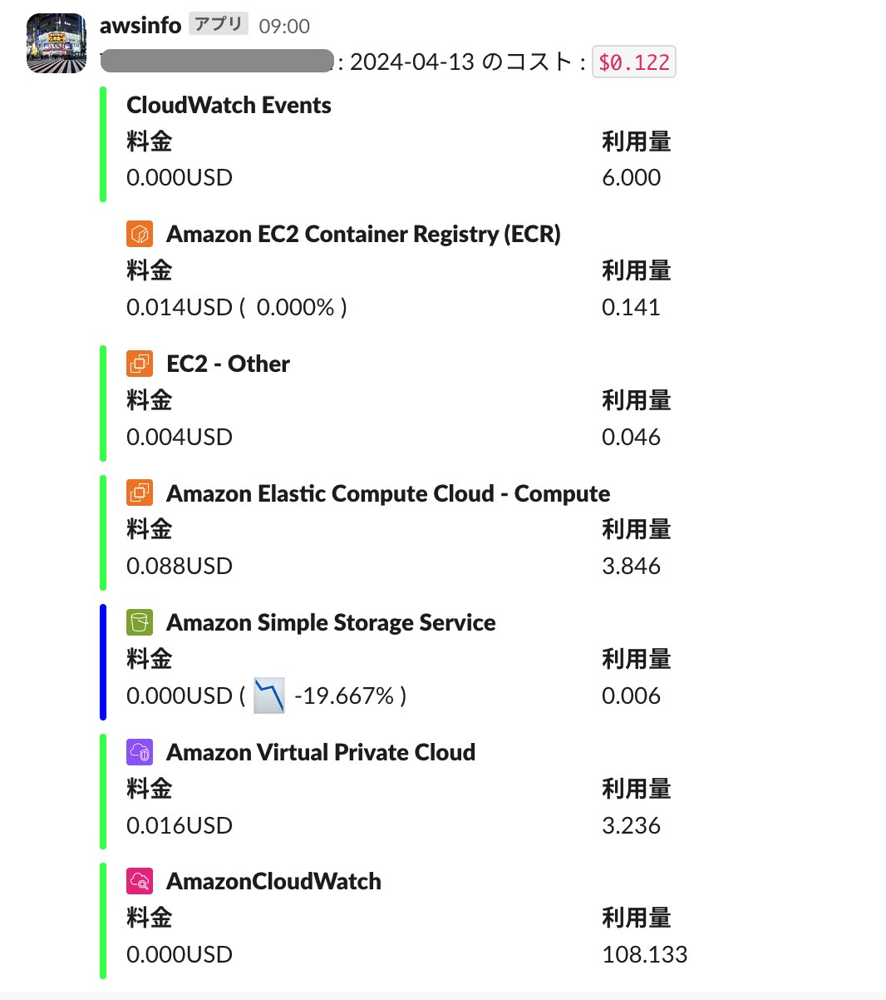
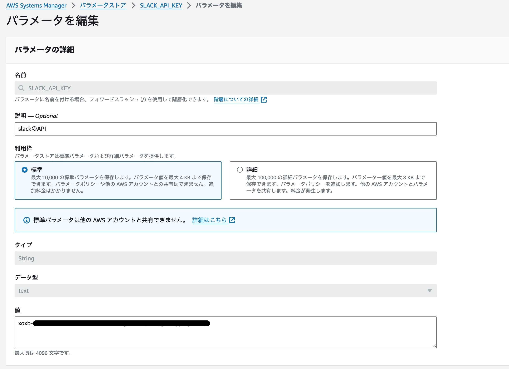

## このリポジトリは？

以下のリポジトリを参考にSAMで動作するように変更した。

https://github.com/tetsuya28/aws-cost-report

## 何ができるの？

以下のように毎朝9:00に前日のAWS利用料をslackに通知する。




## ローカルでテストしたい場合

環境変数に```SLACK_TOKEN```を設定する。

一時的に設定するので、再ログイン時には消えてしまうので注意。

```bash
export SLACK_TOKEN=xoxb-...
```

また、goとして動かしたいときはMakefileを使用するのが便利。

```bash
make run
```

lambdaとして試験する場合はビルドしてからテストする。

build

```bash
sam build
```

テスト。

```bash
sam local invoke
```

## AWSにデプロイする前に

パラメータストアにslackのAPIキーを設定すること。



以下のようにパラメータストアから取得している。

```yaml
      Environment:
        Variables:
            SLACK_TOKEN: '{{resolve:ssm:/SLACK_API_KEY}}'
            SLACK_CHANNEL: information
```


